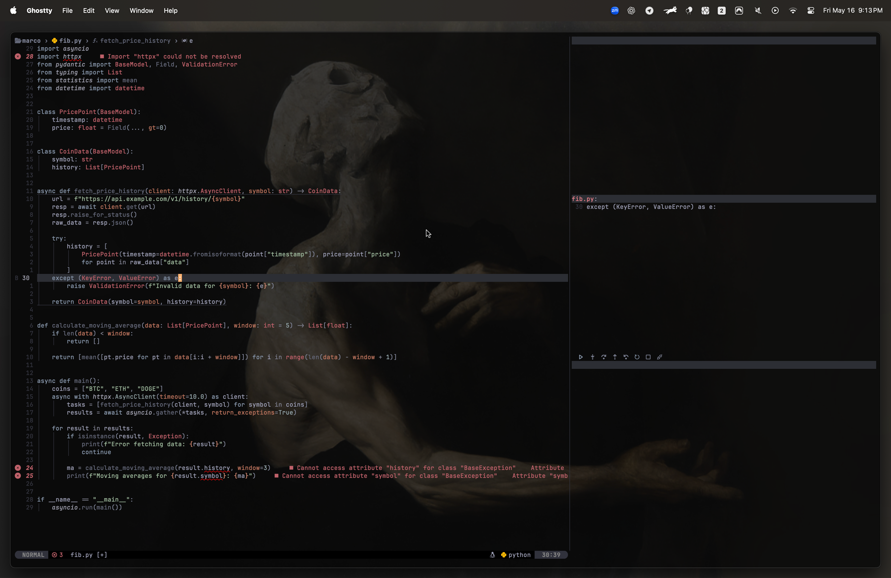

# Simply the most swag neovim config of all time





This is my personal Neovim configuration for 2025, using [Lazy.nvim](https://github.com/folke/lazy.nvim) for plugin management. It includes a robust set of plugins and custom shortcuts tailored for an efficient coding environment.

## Prerequisites

- Neovim >= 0.9.0
- [ripgrep](https://github.com/BurntSushi/ripgrep) - Required for snacks picker live grep
- [lazygit](https://github.com/jesseduffield/lazygit) - Cool git integration
- A [Nerd Font](https://www.nerdfonts.com/) - Required for icons (I recommend JetBrainsMono Nerd Font)

## Features

### Key Plugins

- **[snacks picker](https://github.com/snacks-picker/snacks-picker.nvim)**: Fuzzy finder for files, buffers, and more.
- **[nvim-treesitter](https://github.com/nvim-treesitter/nvim-treesitter)**: Enhanced syntax highlighting and code navigation.
- **[nvim-lspconfig](https://github.com/neovim/nvim-lspconfig)**: Easy configuration for built-in LSP support.
- **[lualine.nvim](https://github.com/nvim-lualine/lualine.nvim)**: Fast and customizable statusline.
- **[nvim-cmp](https://github.com/hrsh7th/nvim-cmp)**: Autocompletion plugin with sources for LSP, snippets, and more.
- **[gitsigns.nvim](https://github.com/lewis6991/gitsigns.nvim)**: Git integration with signs and hunk actions.
- **[alpha-nvim](https://github.com/goolord/alpha-nvim)**: Start screen with a customizable dashboard.
- **[oil.nvim](https://github.com/stevearc/oil.nvim)**: A modern file explorer that provides an alternative to netrw.
- **[trouble.nvim](https://github.com/folke/trouble.nvim)**: A pretty diagnostics list.
- **[harpoon](https://github.com/ThePrimeagen/harpoon)**: Quick file navigation.
- **[lazygit.nvim](https://github.com/kdheepak/lazygit.nvim)**: Git integration with LazyGit.
- **[zen-mode.nvim](https://github.com/folke/zen-mode.nvim)**: Distraction-free coding.
- **[flash.nvim](https://github.com/folke/flash.nvim)**: Enhanced motion and search.
- **[conform.nvim](https://github.com/stevearc/conform.nvim)**: Fast and flexible formatter.
- **[blink.nvim](https://github.com/folke/blink.nvim)**: Smooth cursor blink animation.
- **[avante.nvim](https://github.com/yetone/avante.nvim)**: AI code assistance powered by OpenRouter/Claude.
- **[copilot.lua](https://github.com/zbirenbaum/copilot.lua)**: GitHub Copilot integration.
- **[noice.nvim](https://github.com/folke/noice.nvim)**: Highly experimental plugin that completely replaces the UI for messages, cmdline and the popupmenu.

### Default Language Support

- TypeScript/JavaScript
- Python (with debugger support)
- Lua
- HTML/CSS
- SQL (with vim-dadbod integration)
- (Use mason to install different LSPs, linters and formatters)

### Key Features

- 🚀 Fast startup with lazy loading
- 📦 Automatic plugin management
- 🎨 Beautiful and consistent UI
- 🔍 Powerful fuzzy finding with snacks picker
- 🐛 Integrated debugging
- 📝 Intelligent code completion
- 🔧 Format on save
- 🎯 Git integration
- ⚡ Tmux/Zellij integration

### Keybindings

The `<Leader>` key is set to **`space`** in this configuration.

#### File Navigation

- **`<Leader>ff`**: Find files using snacks picker
- **`<Leader>fg`**: Git files
- **`<Leader>fb`**: Find buffers
- **`<Leader>fr`**: Recent files
- **`<Leader>oo`**: Open Oil file explorer

#### Git Integration

- **`<Leader>lg`**: Open LazyGit
- **`<Leader>gs`**: Git status with snacks picker
- **`<Leader>gb`**: Git branches with snacks picker
- **`<Leader>gf`**: Git files with snacks picker

#### LSP Features

- **`<Leader>ca`**: Code actions
- **`<Leader>rn`**: Rename symbol
- **`gr`**: Show references
- **`gd`**: Go to definition
- **`K`**: Show documentation
- **`<Leader>[d or ]d`**: Next/Previous lspsaga diagnostic
- **`<Leader>d`**: Inline lspsaga diagnostic

#### Debugging

- **`<Leader>db`**: Toggle breakpoint
- **`<Leader>dc`**: Start/Continue debugging
- **`<F8>`**: Start/Continue debugging
- **`<F9>`**: Step into
- **`<F10>`**: Step over
- **`<F11>`**: Step out
- **`<Leader>de`**: Evaluate variable under cursor
- **`<Leader>dt`**: Toggle debugger UI
- **`<Leader>dx`**: Terminate debugger

#### Other Features

- **`<Leader>zm`**: Toggle Zen Mode
- **`<Leader>xx`**: Toggle Trouble diagnostics
- **`<Leader>u`**: Show undo history
- **`<Leader>mp`**: Format file

## Installation

1. **Install Prerequisites**:

   ```bash
   # On macOS
   brew install neovim ripgrep fd lazygit
   ```

2. **Clone the repository**:

   ```bash
   git clone https://github.com/marcosktsz/nvim ~/.config/nvim
   ```

3. **Launch and enjoy**

Lazy will automatically bootstrap and install all preconfigured plugins on first launch.

## Customization

The configuration is organized into modules under `lua/kita/`. Key configuration files:

- `lua/kita/core/options.lua`: General Neovim settings
- `lua/kita/core/keymaps.lua`: Key mappings
- `lua/kita/plugins/`: Individual plugin configurations
